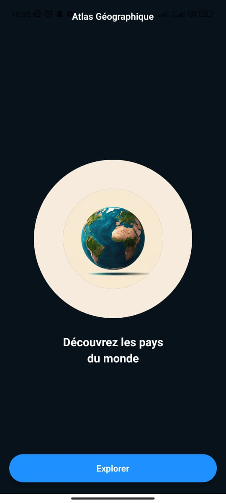
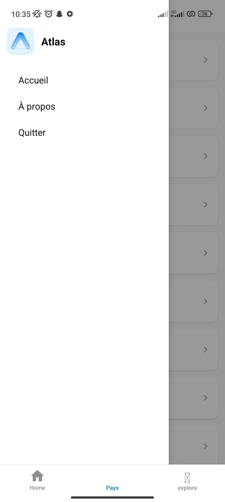
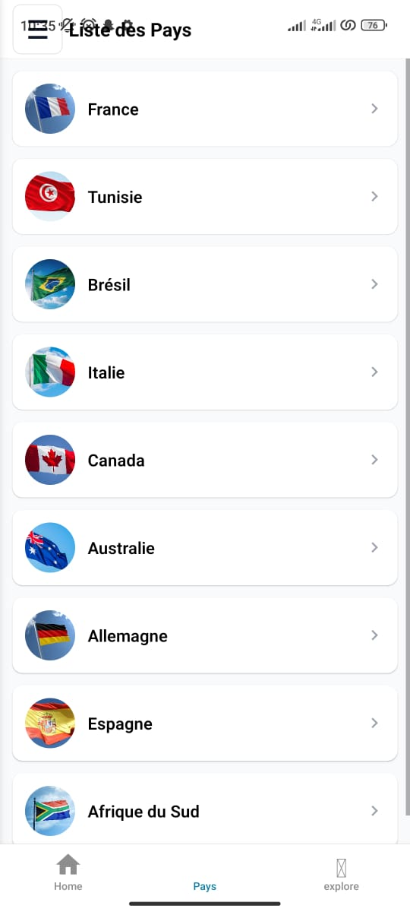
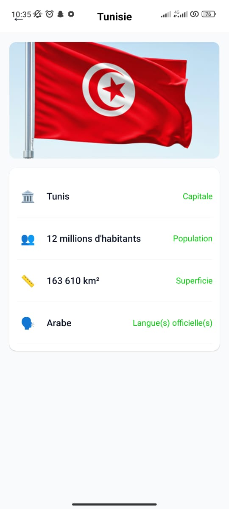

# Atlas Géographique

Application mobile simple (Expo / React Native) qui présente une liste de pays et une fiche de détail pour chaque pays.

## Résumé

L'application comporte 3 écrans principaux :

- **WelcomePage** : page d'accueil avec image (globe) et bouton **Explorer**.
- **CountriesPage** : liste des pays (drapeau miniature + nom). Cliquer sur un pays ouvre la fiche de détail.
- **CountryDetailPage** : affiche le grand drapeau et les informations principales (capitale, population, superficie, langue(s)).

L'objectif est d'être un petit référentiel visuel des pays avec navigation claire entre ces 3 écrans.

## Modèle de données

Le modèle utilisé pour chaque pays est défini dans `models/country.ts` :

- `id` : identifiant court (ex: `tn`, `fr`)
- `name` : nom du pays (ex: `Tunisie`)
- `capital` : capitale (ex: `Tunis`)
- `population` : population lisible (ex: `12 millions`)
- `area` : superficie lisible (ex: `163 610 km²`)
- `languages` : langue(s) (ex: `Arabe`)
- `image` : require pour l'image du drapeau dans `assets/images`

La liste d'exemples se trouve dans `constants/countries.ts`.

## Arborescence (fichiers importants)

- `app/WelcomePage.tsx` — page d'accueil et bouton d'entrée.
- `app/(tabs)/countries.tsx` — liste des pays (écran principal).
- `app/CountryDetailPage.tsx` — fiche détail d'un pays.
- `constants/countries.ts` — source de données statique (liste des pays + images).
- `models/country.ts` — type / classe `Country`.
- `assets/images/` — images des drapeaux et icônes.
- `app/_layout.tsx` — configuration du router (définit la page d'entrée).

## Navigation / Routes

- `WelcomePage` (page d'accueil)
  - Bouton `Explorer` appelle `router.replace('/(tabs)/countries')`.
- `CountriesPage` (liste)
  - Chaque item appelle `router.push(`/CountryDetailPage?id=${id}`)`.
- `CountryDetailPage` (détails)
  - Lit l'id via `useLocalSearchParams` et affiche les données du pays.

## Lancer l'application (Expo) — Windows PowerShell

1. Installer les dépendances si nécessaire :

```powershell
npm install
```

2. Lancer le serveur Expo :

```powershell
npx expo start
```

3. Scanner le QR code avec Expo Go sur votre mobile, ou ouvrir un simulateur.

## Ajouter / modifier un pays

1. Ajouter l'image du drapeau dans `assets/images/`.
2. Ajouter une entrée dans `constants/countries.ts` en respectant la forme :

```ts
{ id: 'xx', name: 'Nom', capital: 'Capitale', population: 'NN millions', area: 'xxx km²', languages: 'Langue', image: require('@/assets/images/mon_drapeau.png') }
```

3. Relancer l'application (reload) pour voir la modification.

## Comportements spéciaux

- Le drawer (menu latéral) a été implémenté dans `CountriesPage` :
  - Accueil : revient à `WelcomePage`.
  - À propos : ouvre `app/about.tsx`.
  - Quitter : affiche une confirmation et appelle `BackHandler.exitApp()` sur Android.

- Les icônes sont rendues à l'aide du composant `IconSymbol` (ou d'Unicode pour les boutons simples) selon disponibilité.

## Dépannage

- Si vous ne voyez pas le bouton hamburger : l'icône a été remplacée par un caractère Unicode `☰` et le bouton a été agrandi (48x48) pour être visible sur la plupart des écrans.
- Si une image ne s'affiche pas : vérifiez le chemin dans `constants/countries.ts` et assurez-vous que le fichier existe dans `assets/images`.

## Prochaines améliorations possibles

- Charger la liste des pays depuis une API distante.
- Ajouter un écran de recherche/filtrage (par continent, population, etc.).
- Ajouter tests unitaires et snapshots pour les composants principaux.

---

Si tu veux, je peux :
- ajouter un script `npm run start:android`/`start:ios` au `package.json` ;
- connecter l'app à une API publique (ex: restcountries.eu) ;
- générer des tests de base.
## Screenshots

Voici un aperçu de l'application. Copie l'image souhaitée dans `assets/images/screenshots/` puis mets à jour le nom de fichier ci-dessous si nécessaire.

Les captures suivantes sont incluses dans le dossier `assets/images/screenshots/` :

- `atlas.jpg` — icône / couverture de l'application
- `welcomepage.jpg` — écran d'accueil
- `listpays.jpg` — liste des pays
- `pays.jpg` — fiche détail d'un pays

Affichage intégré :









_Si une image ne s'affiche pas, vérifie que le fichier existe dans `assets/images/screenshots/` et que le nom correspond exactement (respect de la casse)._ 

# Welcome to your Expo app 👋

This is an [Expo](https://expo.dev) project created with [`create-expo-app`](https://www.npmjs.com/package/create-expo-app).

## Get started

1. Install dependencies

   ```bash
   npm install
   ```

2. Start the app

   ```bash
   npx expo start
   ```

In the output, you'll find options to open the app in a

- [development build](https://docs.expo.dev/develop/development-builds/introduction/)
- [Android emulator](https://docs.expo.dev/workflow/android-studio-emulator/)
- [iOS simulator](https://docs.expo.dev/workflow/ios-simulator/)
- [Expo Go](https://expo.dev/go), a limited sandbox for trying out app development with Expo

You can start developing by editing the files inside the **app** directory. This project uses [file-based routing](https://docs.expo.dev/router/introduction).

## Get a fresh project

When you're ready, run:

```bash
npm run reset-project
```

This command will move the starter code to the **app-example** directory and create a blank **app** directory where you can start developing.

## Learn more

To learn more about developing your project with Expo, look at the following resources:

- [Expo documentation](https://docs.expo.dev/): Learn fundamentals, or go into advanced topics with our [guides](https://docs.expo.dev/guides).
- [Learn Expo tutorial](https://docs.expo.dev/tutorial/introduction/): Follow a step-by-step tutorial where you'll create a project that runs on Android, iOS, and the web.

## Join the community

Join our community of developers creating universal apps.

- [Expo on GitHub](https://github.com/expo/expo): View our open source platform and contribute.
- [Discord community](https://chat.expo.dev): Chat with Expo users and ask questions.
